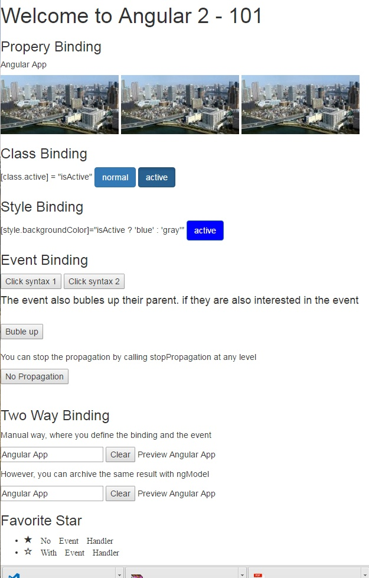

# Angular2-101

This is the starting point for developers with some basic knowledge of HTML, CSS, Javascript who want to throw into Angular2 JS.  Most of the samples are from the course [Angular 2 with TypeScript](https://www.udemy.com/angular-2-tutorial-for-beginners/learn/v4/overview) by Mosh Hamedi on Udemy.
I'm developping  the Angular 2 samples along way I'm learning Angular 2. If you have time, I recommend you to take the course because it has richer contents.

- [Jumpstart](https://github.com/dacho68/Angular2-Jumpstart) - Quick understanding of how to build an App with Angular 2.
- 101 - Property Binding, Class and Style Binding, Event Binding, Two way Binding.
- [102](https://github.com/dacho68/Angular2-102) - Component API in depth.
- [103](https://github.com/dacho68/Angular2-103) - Controlling Rendering of the HTML.
- [104](https://github.com/dacho68/Angular2-104) - Forms and Validations.

## Setup the environment on Windows for running the samples
- First install [NodeJs](https://nodejs.org/en/)
- Install typescript globally

```
npm install -g typescript
npm install -g typings
```

We are going to use [Visual Studio Code](http://code.visualstudio.com/) for editing our project
after you checkout this repository. Run the command below for install the dependencies

```
npm install
npm start
```

**Note :** In Angular, use single back quote (`) for multiple line editing.

## Property Binding

One way binding from the Component to DOM. There are 3 ways to bind a property, see the img binding below.  

**Syntax :**
    1.  DOM attribute in the square bracket      -> [attribute]="component property"
    2.  Prefix with the DOM attribute with bind- -> bind-attribue = "component property"
    3.  Interpolation                            -> {{ component property }}  

**Example :**
``` html5
    <h5>{{ title }}</h5>
    
    
    
```
See: [Property Binding Example](https://github.com/dacho68/Angular2-101/blob/master/app/propertyBindingTutorial.component.ts)  

## Class and Style Binding
  **Syntax :** 
   
        [class.class-name] = "component property"
        [style.style-property] = "component property"    
      
**Example :**
``` html5
    <button class="btn btn-primary" [class.active]="isActive">active</button>
    <button class="btn btn-primary" [style.backgroundColor]="isActive ? 'blue' : 'gray'">active</button>
```

See: [Class and Style Binding Example](https://github.com/dacho68/Angular2-101/blob/master/app/classBindingTutorial.component.ts)   

## Event Binding

There are 2 ways to do the event binding as shown below. We can pass the DOM event to the handler method in the component by using the $event.
If the parent container has also the interest in the event, then event will bubble up to their parent. However, you can stop the 
bubbling by calling  $event.stopPropagation().

**Syntax :** 
        1. (event)="event handler in the component"
        2. on-event="event handler in the component"

**Example :**
``` html5
    <button (click)="onClick($event)">Click syntax 1</button> 
    <button on-click="onClick($event)">Click syntax 2</button>          
    <br>
    <h4>The event also bubles up their parent. if they are also interested in the event </h4>  
    <br>         
    <div (click) = "onDivClick()" >
      <button on-click = "onClick($event)">Buble up</button>
    </div>
    <br>
```
See: [Event Binding Example](https://github.com/dacho68/Angular2-101/blob/master/app/eventBindingTutorial.component.ts)


## Two way Data Binding

When developing data entry forms, we often want to both display a data property and update that property when the user makes changes.
   
**Syntax :**
   
        <input [(ngModel)]="event handler in the component">
        <input bindon-ngModel="currentHero.firstName">

**Example :**   
``` html5   
    <input type="text" [(ngModel)]= "title" />
    <input type="button" (click)="title = ''" value="Clear" />
    Preview {{ title }}
```   
See: [Two way Binding Example](https://github.com/dacho68/Angular2-101/blob/master/app/twoWayBindingTutorial.component.ts)

## Exercise - Make a favorite start toggle between full and empty    

Use the glyphicon from bootstrap to render the icon.

_Hints :_
``` html5   
    <i class = "glyphicon glyphicon-star" />
    <i class = "glyphicon glyphicon-star-empty" />
```    
See: [Solution](https://github.com/dacho68/Angular2-101/blob/master/app/favorite.component.ts)

## Output

